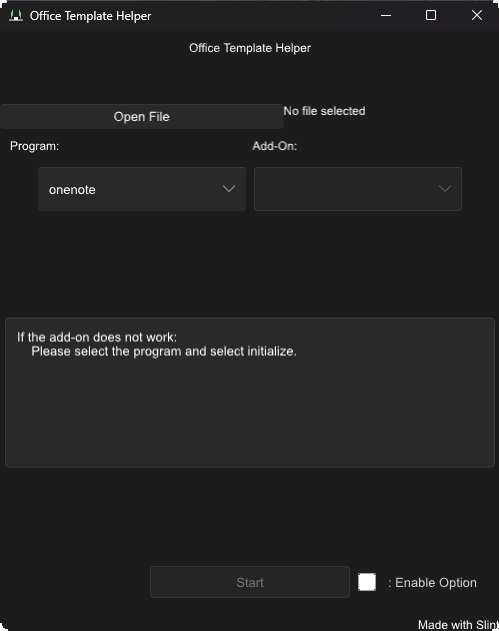

<!-- Improved compatibility of back to top link: See: https://github.com/othneildrew/Best-README-Template/pull/73 -->
<a name="readme-top"></a>
<!--
*** Thanks for checking out the Best-README-Template. If you have a suggestion
*** that would make this better, please fork the repo and create a pull request
*** or simply open an issue with the tag "enhancement".
*** Don't forget to give the project a star!
*** Thanks again! Now go create something AMAZING! :D
-->


<!-- PROJECT SHIELDS -->
<!--
*** I'm using markdown "reference style" links for readability.
*** Reference links are enclosed in brackets [ ] instead of parentheses ( ).
*** See the bottom of this document for the declaration of the reference variables
*** for contributors-url, forks-url, etc. This is an optional, concise syntax you may use.
*** https://www.markdownguide.org/basic-syntax/#reference-style-links
-->
[![Contributors][contributors-shield]][contributors-url]
[![Forks][forks-shield]][forks-url]
[![Stargazers][stars-shield]][stars-url]
[![Issues][issues-shield]][issues-url]
[![MIT License][license-shield]][license-url]


<!-- PROJECT LOGO -->
<br />
<div align="center">
  <a href="https://github.com/jbirbal-skydom/Office-Template-Helper">
    
  </a>

<h3 align="center"> Office Template Helper</h3>

  <p align="center">
    project_description
    <br />
    <a href="https://github.com/jbirbal-skydom/Office-Template-Helper"><strong>Explore the docs »</strong></a>
    <br />
    <br />
    <a href="https://github.com/jbirbal-skydom/Office-Template-Helper">View Demo</a>
    ·
    <a href="https://github.com/jbirbal-skydom/Office-Template-Helper/issues">Report Bug</a>
    ·
    <a href="https://github.com/jbirbal-skydom/Office-Template-Helper/issues">Request Feature</a>
  </p>
</div>


<!-- TABLE OF CONTENTS -->
<details>
  <summary>Table of Contents</summary>
  <ol>
    <li>
      <a href="#about-the-project">About The Project</a>
      <ul>
        <li><a href="#built-with">Built With</a></li>
      </ul>
    </li>
    <li>
      <a href="#getting-started">Getting Started</a>
      <ul>
        <li><a href="#prerequisites">Prerequisites</a></li>
        <li><a href="#installation">Installation</a></li>
      </ul>
    </li>
    <li><a href="#usage">Usage</a></li>
    <li><a href="#roadmap">Roadmap</a></li>
    <li><a href="#contributing">Contributing</a></li>
    <li><a href="#license">License</a></li>
    <li><a href="#contact">Contact</a></li>
    <li><a href="#acknowledgments">Acknowledgments</a></li>
  </ol>
</details>


<!-- ABOUT THE PROJECT -->
## About The Project

<p align="center">
  <a href="https://github.com/jbirbal-skydom/Office-Template-Helper">
    
  </a>
</p>

Office Template Helper is a versatile desktop application designed to enhance the productivity of Microsoft Office users by enabling the easy integration of add-ons directly into Office files via XML modifications. With a user-friendly graphical interface, Office Template Helper allows users to seamlessly select and inject add-on templates, such as brainstorming aids and cross-functional flowcharts, into existing Office documents.

### Built With

* [![Slint][slint-lang]][Slint-url]
* [![Rust][rust-lang]][Rust-url]
* [![C][c-lang]][C-url]
* [![GCC][gcc-badge]][GCC-url]

<p align="right">(<a href="#readme-top">back to top</a>)</p>

**Key Features:**

- **Intuitive GUI**: Offers a simple, clean, and easy-to-navigate interface that allows even non-technical users to modify Office files effortlessly.
- **Add-On Selection**: Users can choose from a list of available add-ons, including specialized templates for brainstorming sessions and detailed flowchart designs.
- **XML Modification**: Automatically adds the necessary XML line to an Office file to activate the selected add-on, simplifying what would otherwise be a manual and complex process.
- **Compatibility**: Supports a wide range of Office file formats, ensuring broad usability across different Office applications such as Visio, Word, and Excel.
- **Efficiency**: Streamlines workflow by integrating add-ons quickly, reducing the time and effort typically required for template setup and customization.


**Benefits:**

- **Enhanced Productivity**: Quickly add complex templates to documents, enabling faster preparation and more effective information organization.
- **Customization**: Offers the flexibility to customize documents with advanced tools, catering to specific project needs and preferences.
- **Ease of Use**: Removes the technical barriers associated with XML file manipulation, making advanced document customization accessible to all users.


**Intended Users:**

OfficeTemplateHelper is ideal for business professionals, project managers, and anyone involved in document preparation who seeks to enhance the functionality of their Office documents with advanced graphical templates and tools.

<p align="right">(<a href="#readme-top">back to top</a>)</p>


<!-- GETTING STARTED -->
## Getting Started

All releases are on github on the right tab that says release. Please contribute <3

### Prerequisites

The only dependency was for WSL:
* Windows
  * None
* MacOS
  *  None 
* Linux
  *  None 
* WSL
    * Zenity: `sudo apt-get -y install zenity
`

### Installation
* Windows
  * Download release 
* MacOS
  *  Download release 
* Linux
  *  Download release 
* WSL
  * Dependencies:
    * Zenity: `sudo apt-get -y install zenity
`

### Build
To get started with Office Template Helper, follow these steps:
1. Clone the repository:
    ```sh
    git clone https://github.com/jbirbal-skydom/Office-Template-Helper.git
    ```
2. Navigate to the project directory:
   ```sh
   cd Office-Template-Helper
   ```
3. build icon
   ```sh
   windres app_icon.rc -O coff -o app_icon.res

   ```
4. Build `cargo build`
   1. Linux
      1. cargo build --target x86_64-unknown-linux-gnu
   2. Windows
      ```sh
      cargo build --target x86_64-pc-windows-gnu
      ```
   3. Macos
   ___
5. Move `.exe` to root with the following folders
   1.  `Setting` 
   2.  `Reference`
  ___

1. **Cross-Build**
   1. Host Linux
      1. Target:
         1. Windows
            1. `sudo apt-get install mingw-w64`
            2. `rustup add x86_64-pc-windows-gnu`
            3. `cargo build --target x86_64-pc-windows-gnu`


<p align="right">(<a href="#readme-top">back to top</a>)</p>


<!-- USAGE EXAMPLES -->
## Usage

To use Office Template Helper, launch the application and follow these steps:

1. Open the GUI.
2. Select the Office file you want to enhance.
3. Choose a template from the available options.
4. Apply the template to integrate it into your Office file.

For more detailed instructions, refer to the User Manual.

I've used it with `Visio` but it has the ability to be use with any of the **Office Open XML** ( [OOXML] ) but I mainly built it for `Visio`. This is open sourced and if you want to add an add on on another app look at the `addon.yaml` secion in the settings tab below

<p align="right">(<a href="#readme-top">back to top</a>)</p>


  ### Configuring the Application

  This application is customizable through configuration files located in the user-specific configuration directory. Here are the platform-specific paths where these files are located:

  | **Platform** | **Configuration Directory**               | **Example Path**                                 |
  |--------------|------------------------------------------|--------------------------------------------------|
  | **Linux**    | `$XDG_CONFIG_HOME` or `$HOME/.config`    | `/home/alice/.config`                            |
  | **macOS**    | `$HOME/Library/Application Support`      | `/Users/Alice/Library/Application Support`       |
  | **Windows**  | `{FOLDERID_LocalAppData}`                | `C:\Users\Alice\AppData\Local`                   |

  ### Editing Configuration Files

  Navigate to the configuration directory appropriate for your platform and modify the `.yaml` files using a text editor. The primary configuration files are:

  1. `addon.yaml` - Manages add-on configurations.
  2. `valid_files.yaml` - Maps file extensions to reference files for integrity checks.
  3. `theme.yaml` - Handles theming and UI customizations.

  #### Add-on Configurations

  `addon.yaml` organizes data with nested structures to define how add-ons interact with the application:

  ```yaml
  visio:
    EventList:
      - file: "visio/document.xml"  # Path to the brainstorm file
        edits: >  # Add EventList element
          <EventList>
          </EventList>
        loc: "VisioDocument"
        after: false
  ```

  - **Levels of Indentation**: Each level represents a new scope within the configuration:
    - **Application Name**
    - **Addon Name**
    - **Addon Changes**: Specifies the target file, the modifications to be made, and their location within the file.

  #### File Format Settings

  `valid_files.yaml` provides a straightforward mapping of file extensions to their reference paths, ensuring the application maintains integrity during file edits:

  ```yaml
  reference:
    vsdx: "reference/visio.vsdx"
  ```

  - **One-layer Nest**: Each entry maps a file extension to a reference file path used by the application.

  ### Steps to Modify Settings

  1. Open the configuration file you need to edit, such as `addon.yaml` or `valid_files.yaml`.
  2. Make the necessary changes based on the examples provided.
  3. Save the changes and restart the application if necessary to apply the new settings.

  <p align="right">(<a href="#readme-top">back to top</a>)</p>


<!-- ROADMAP -->
## Roadmap

- [x] GUI
  - [X] Windows
  - [X] Linux
  - [x] MacOs
  - [X] WSL
  - [ ] Theme
- [ ] Microsoft Products
  - [x] Visio
    - [x] File Format
    - [X] Brainstorm
    - [X] Cross-Functional Flowchart
    - [x] Timeline
  - [ ] Excel
    - [ ] File Format 
  - [ ] Words
    - [ ] File Format
  - [ ] PowerPoint
    - [ ] File Format
  - [ ] Project
    - [ ] File Format
  - [ ] Outlook
    - [ ] File Format


___ 
## Explanation:  

## Understanding the File Structure of Microsoft Office Files

Modern Microsoft Office files, such as those created by Office 2007 and later versions, are built using the Open XML standard. This design choice provides a robust, open, and reusable data format. Below, we explore how these files are structured, particularly focusing on their ZIP and XML components.

### ZIP Format Overview

Office files (.docx, .xlsx, .pptx, etc.) are essentially ZIP archives that contain multiple files and folders. These ZIP archives consolidate various parts of a document into a single, compressed file, making storage and transfer more efficient. When you rename an Office file to have a `.zip` extension and open it with a zip utility, you will see its internal structure.

### Internal XML Structure

Inside the ZIP archive, the content of the file is organized into a series of folders and XML files that describe the document's properties, content, and formatting:

- **`[Content_Types].xml`**: This file defines the types of files contained within the ZIP archive and their corresponding MIME types.

- **`_rels`**: A folder containing `.rels` files, which are relationship files mapping the connections between various parts of the document (like which images are used where).

- **`docProps`**: This folder contains XML files that store properties about the document itself, such as the author, creation date, and modification date (`core.xml`), as well as custom-defined properties (`custom.xml`) and application-specific properties (`app.xml`).

- **`word`, `excel`, `ppt`** (depending on the type of Office file): These directories contain the actual content of the document. For instance, in a Word file (`word`), you will find:
  - **`document.xml`**: The main document content.
  - **`styles.xml`**: Definitions of the styles used in the document.
  - **`settings.xml`**: Document-specific settings like spelling, grammar checks, and compatibility settings.
  - **`theme`**: Theme information used across the document.
  - **`media`**: A folder containing embedded media files such as images.

### Advantages of Using ZIP and XML

1. **Compression**: Using ZIP format allows the Office files to be compressed, reducing the file size and making it easier to share and store.
2. **Modularity and Accessibility**: The use of XML makes data extraction and manipulation straightforward, which can be particularly useful for data analysis and automated report generation.
3. **Standardization**: XML provides a standard format that can be read by many different types of software, enhancing interoperability.

The combination of ZIP and XML in Office files aligns with modern data handling practices by ensuring that documents are compact, robust, and ready for integration with various data systems.


___

See the [open issues](https://github.com/jbirbal-skydom/Office-Template-Helper/issues) for a full list of proposed features (and known issues).

<p align="right">(<a href="#readme-top">back to top</a>)</p>


<!-- CONTRIBUTING -->
## Contributing

Contributions are what make the open source community such an amazing place to learn, inspire, and create. Any contributions you make are **greatly appreciated**.

If you have a suggestion that would make this better, please fork the repo and create a pull request. You can also simply open an issue with the tag "enhancement".
Don't forget to give the project a star! Thanks again!

1. Fork the Project
2. Create your Feature Branch (`git checkout -b feature/AmazingFeature`)
3. Commit your Changes (`git commit -m 'Add some AmazingFeature'`)
4. Push to the Branch (`git push origin feature/AmazingFeature`)
5. Open a Pull Request

<p align="right">(<a href="#readme-top">back to top</a>)</p>


<!-- LICENSE -->
## License

Distributed under the WTFPL License. See `LICENSE.txt` for more information.

<p align="right">(<a href="#readme-top">back to top</a>)</p>


<!-- CONTACT -->
## Contact

Jason Birbal - officehelper@skydom.ai

Project Link: [https://github.com/jbirbal-skydom/Office-Template-Helper](https://github.com/jbirbal-skydom/Office-Template-Helper)

<p align="right">(<a href="#readme-top">back to top</a>)</p>


<!-- ACKNOWLEDGMENTS -->
## Acknowledgments

* [Zip File](https://superuser.com/questions/145479/excel-edit-the-xml-inside-an-xlsx-file)
* [vsdx python software ](https://github.com/dave-howard/vsdx/)
* [OOXML]
  

<p align="right">(<a href="#readme-top">back to top</a>)</p>


<!-- MARKDOWN LINKS & IMAGES -->
<!-- https://www.markdownguide.org/basic-syntax/#reference-style-links -->
[contributors-shield]: https://img.shields.io/github/contributors/jbirbal-skydom/Office-Template-Helper.svg?style=for-the-badge
[contributors-url]: https://github.com/jbirbal-skydom/Office-Template-Helper/graphs/contributors
[forks-shield]: https://img.shields.io/github/forks/jbirbal-skydom/Office-Template-Helper.svg?style=for-the-badge
[forks-url]: https://github.com/jbirbal-skydom/Office-Template-Helper/network/members
[stars-shield]: https://img.shields.io/github/stars/jbirbal-skydom/Office-Template-Helper.svg?style=for-the-badge
[stars-url]: https://github.com/jbirbal-skydom/Office-Template-Helper/stargazers
[issues-shield]: https://img.shields.io/github/issues/jbirbal-skydom/Office-Template-Helper.svg?style=for-the-badge
[issues-url]: https://github.com/jbirbal-skydom/Office-Template-Helper/issues
[license-shield]: https://img.shields.io/github/license/jbirbal-skydom/Office-Template-Helper.svg?style=for-the-badge
[license-url]: https://github.com/jbirbal-skydom/Office-Template-Helper/blob/master/LICENSE.txt
[product-screenshot]: images/screenshot.png


 <!-- Badge  -->

[rust-lang]: https://img.shields.io/badge/Rust-f74c00?style=for-the-badge&logo=rust&logoColor=white
[Rust-url]: https://www.rust-lang.org/
[c-lang]: https://img.shields.io/badge/C-00599C?style=for-the-badge&logo=c&logoColor=white
[C-url]: "https://en.wikipedia.org/wiki/C_(programming_language)"
[slint-lang]: https://img.shields.io/badge/Slint-7F52FF?style=for-the-badge&logo=slint&logoColor=white
[Slint-url]: https://slint-ui.com/
[jabcode-badge]: https://img.shields.io/badge/JABCode-00eded?style=for-the-badge&logo=data:image/svg+xml;base64,PHN2ZyB2ZXJzaW9uPSIxLjIiIHhtbG5zPSJodHRwOi8vd3d3LnczLm9yZy8yMDAwL3N2ZyIgdmlld0JveD0iMCAwIDI1IDI1IiB3aWR0aD0iMjUiIGhlaWdodD0iMjUiPgoJPHRpdGxlPmphYmNvZGVfYmFkZ2U8L3RpdGxlPgoJPHN0eWxlPgoJCS5zMCB7IGZpbGw6ICNmZmZmZmYgfSAKCTwvc3R5bGU+Cgk8cGF0aCBpZD0iUGF0aCAwIiBjbGFzcz0iczAiIGQ9Im0wIDE1di0xNWgxNXY1aC0xMHYxMHoiLz4KCTxwYXRoIGlkPSJQYXRoIDAiIGNsYXNzPSJzMCIgZD0ibTYgMTV2LTloOXYzaC02djZ6Ii8+Cgk8cGF0aCBpZD0iUGF0aCAwIiBjbGFzcz0iczAiIGQ9Im0xMCAxNXYtNWg1djV6Ii8+Cgk8cGF0aCBpZD0iUGF0aCAwIiBjbGFzcz0iczAiIGQ9Im0xMCAxNmg2di02aDN2OWgtOXoiLz4KCTxwYXRoIGlkPSJQYXRoIDAiIGNsYXNzPSJzMCIgZD0ibTEwIDIwaDEwdi0xMGg1djE1aC0xNXoiLz4KPC9zdmc+
[JABCode-url]: https://jabcode.org
[gcc-badge]: https://img.shields.io/badge/GCC-4E9A06?style=for-the-badge&logo=gnu&logoColor=white
[GCC-url]: https://gcc.gnu.org/

<!-- links -->
[OOXML]: (http://officeopenxml.com/)